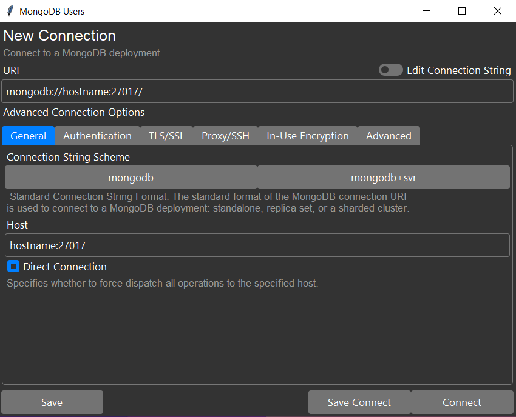
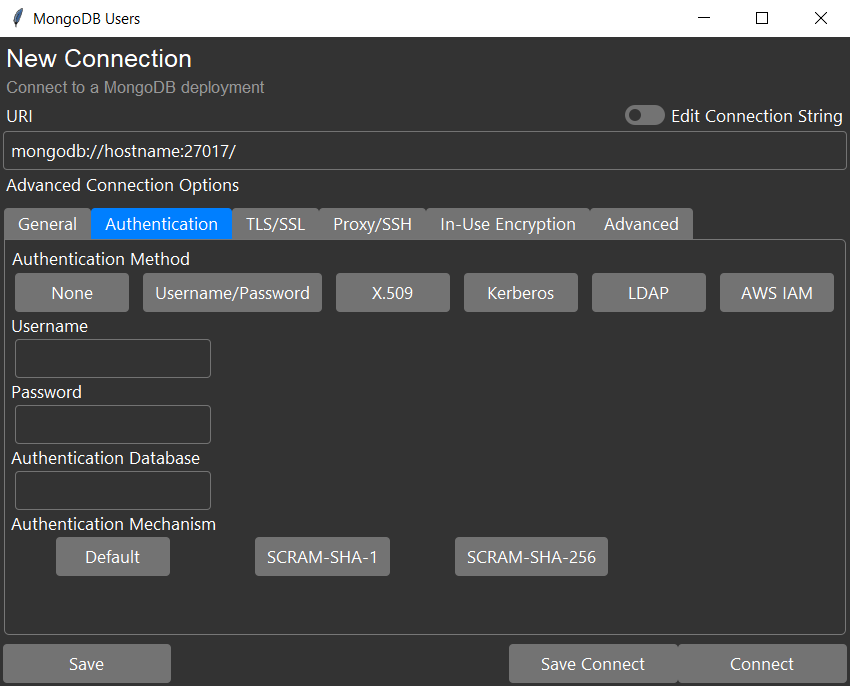
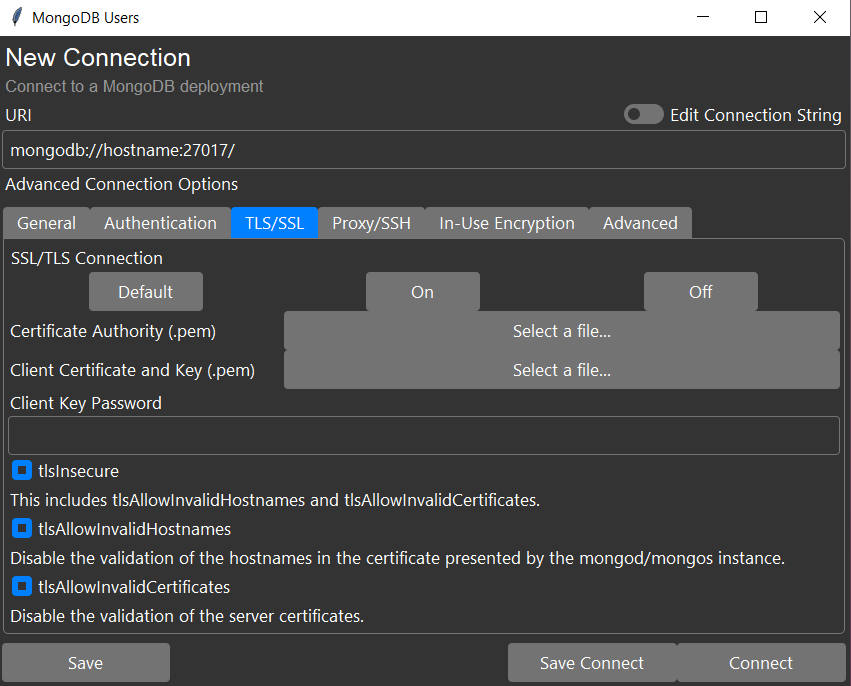
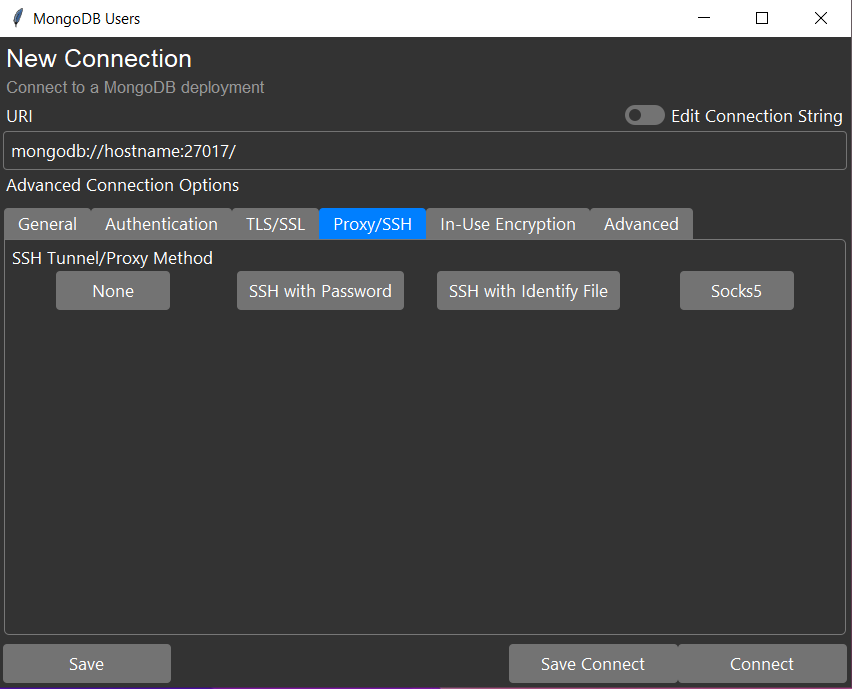

# Descripción

Tool used for manager (update rol, remove user or create new user and
roles) the user and roles of MongoDB database. This tool support
connections to Mongo Atlas and instances in local.

## Enunciado

Se quiere construir un programas que permita manejar un triángulo.
Esta figura geométrica está definida por tres puntos, cada uno de
los cuales tiene dos coordenadas X, Y. Un triángulo tiene, además, un
color para las lineas y un color de relleno. Un color, por su parte,
está definido por tres valores numéricos entre 0 y 255 (estándar
RGB por Red-Green-Blue). EL primer valor numérico define la intensidad
en rojo, el segundo valor define la intensidad en verde y el tercer
valor define la intensidad en azul.

El programas debe (1) dibujar el triángulo en la pantalla,
(2) calcular el perímetro del triángulo, (3) calcular el área del
triángulo, (4) calcular la altura del triángulo.

## Interfaz

